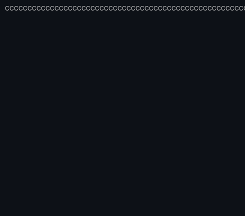

<div align="center">
  
  
  # 💻 Kaustav Mukherjee's Workspace

  
  
  <br/>
  
  

</div>

<br/>

<div align="center">
  
</div>

```bash
> whoami
Kaustav Mukherjee

> cat ~/.profile
Hi 👋, I'm Kaustav! 
Building websites and exploring data analytics.
I enjoy turning ideas into simple web experiences and transforming messy datasets into clean insights.

> ls -l ~/What_Im_Working_On
🌐 Building responsive websites and UI experiments
📊 Practicing data analytics and visualization
🧠 Exploring efficient workflows for development and analysis
⚡ Turning ideas into quick prototypes and projects
```

<br/>

<div align="center">
  
</div>

```json
{
  "Education": [
    {
      "Degree": "Master of Technology (M.Tech)",
      "Major": "Electronics & Telecommunication Engineering",
      "Institution": "IIEST, Shibpur",
      "Year": "2024 - Present"
    },
    {
      "Degree": "Bachelor of Technology (B.Tech)",
      "Major": "Electronics & Communication Engineering",
      "Institution": "Meghnad Saha Institute of Technology"
    }
  ],
  "FunFact": "Always debugging something — websites, dashboards, or life."
}
```

<br/>

<div align="center">
  
</div>

### 🧰 Tech Stack & Tools

<p align="center">
  <code>Programming & Web</code><br/>
  
</p>
<p align="center">
  <code>Databases & Analytics</code><br/>
  
  
  
  
  
  
</p>
<p align="center">
  <code>Platforms & IDEs</code><br/>
  
  
  
  
  
  
  
</p>

<br/>

<div align="center">
  
</div>

### 📊 GitHub Stats

<p align="center">
  
  
</p>

<p align="center">
  
</p>

<p align="center">
  
</p>


<br/>

<div align="center">
  
</div>

### 📫 Connect With Me

<p align="center">
  <a href="https://www.linkedin.com/in/kaustav-mukherjee-471a21219/">
    
  </a>
  <a href="mailto:kaustavmukherjee2023@gmail.com">
    
  </a>
  <a href="https://kaustav-portfolio-v2.vercel.app/">
    
  </a>
</p>

<br/>

<p align="center">
  <i>Readme stylized with a Vibe Coding ✨ Theme</i>
</p>
